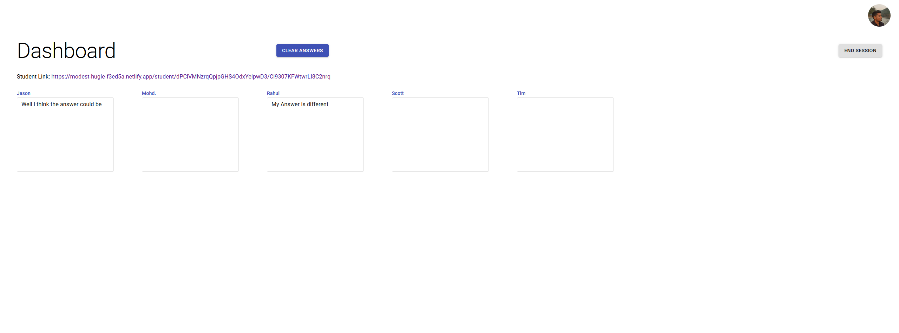
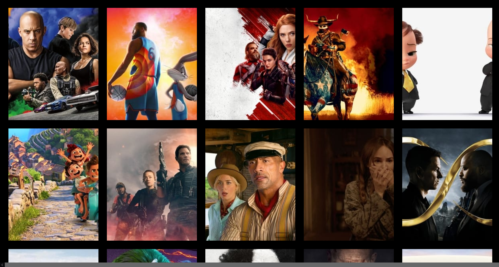
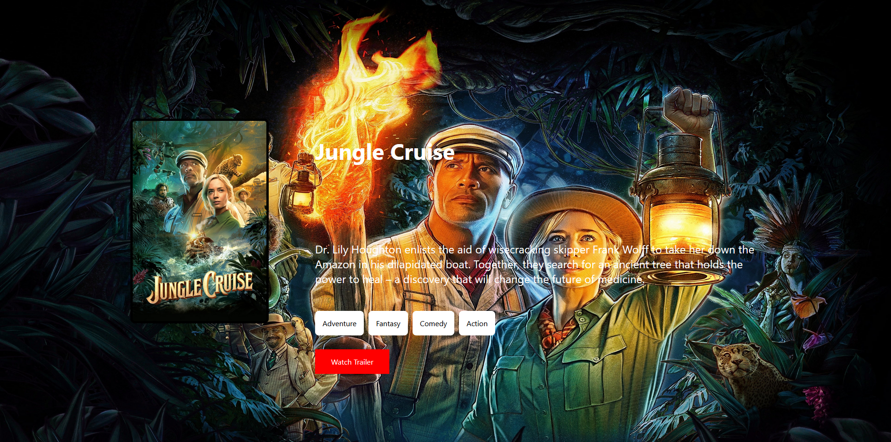

👋 Hi, I’m Rahul shukla, I’m an independent full-stack web developer, who is passionate about bringing a client’s visions to life. I look at technology as a tool to make life easier for everyone, I have a good understanding of databases like MongoDB and Firebase, backend technologies like ExpressJs NodeJs. I love working on the front end with React, NextJs. I am passionate and open to learning new technologies in this field to stay on top of my game.

Have a look at a few projects i have built recently.

## DevTalks: Social media for Technology enthusiasts | [Live Link](https://determined-pike-9e5056.netlify.app/) | [Github Repo](https://github.com/RahulShuklaTech/dev-talk-front)

The project is a social media website design for techies to share their thoughts and follow other users. The website is made from scratch including the custom login and signup which includes authentication and authorization done by Json Web Tokens. The technologies i have used for this are listed below.

##### Front-end
  - ReactJS
  - Chakra UI
  - Netlify for frontend hosting

##### Back-end
  - NodeJs
  - ExpressJs
  - MongoDB
  - JWT
  - Heroku for backend hosting

#### Feed

#### Sign Up

#### Profile

## Everyone Answers: Share your work live | [Live Link](https://modest-hugle-f3ed5a.netlify.app/) | [Github Repo](https://github.com/RahulShuklaTech/capstone-answers)

The project is made to solve a unique challenge been faced by teachers during online classes these days. Teachers can get a live feedback from students in response to question asked during class. This project will work as tool to check the students understanding in a online class or a classroom. 

##### Front-end
  - ReactJS
  - Redux
  - Material UI
  - Netlify for frontend hosting

##### Back-end
  - Firebase firestore
  - Firbase Auth

#### Student Names 

#### Teachers View

#### Student View

## Browse Movies | [Live Link](https://tender-roentgen-7191a9.netlify.app/) 
Wanna see what movies are popular or what do you wanna watch next time you go out for a  movie night, you can watch movie trailers check IMDB information for the movies before you go.

Based on information provided by **TMDB** movie database. The frontend is made in react.

#### Front Page 

#### Movie Page 

<!---
RahulShuklaTech/RahulShuklaTech is a ✨ special ✨ repository because its `README.md` (this file) appears on your GitHub profile.
You can click the Preview link to take a look at your changes.
--->
